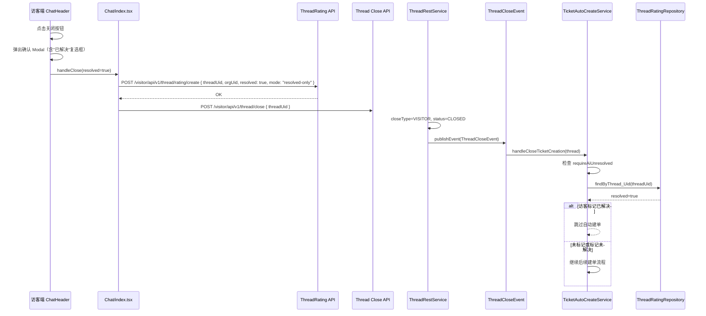

# 访客关闭会话时记录问题解决状态 & 自动建单联动 — 规划文档

> 日期：2026-07-28
> 状态：**已完成实施**（全部 36 项变更已实现，测试通过，locale 已补齐）
> 关联 TODO：[TODO-2026.md](../../TODO-2026.md)
> 前置依赖：多关闭类型自动建单已实施（[2026-07-27-thread-auto-close-create-ticket-plan.md](./2026-07-27-thread-auto-close-create-ticket-plan.md)）

---

## 1. 概述

当前访客关闭会话时，关闭确认弹窗只有"确定/取消"两个按钮，没有收集"问题是否已解决"的信息。同时，自动建单判断"AI 是否已解决"仅依赖 `QueueMemberEntity.resolved/resolvedStatus`，未参考访客在关闭会话时主动表达的解决状态。

结合当前代码基线，已确认以下事实：

1. visitor 关闭按钮当前由 `ChatHeader.handleCloseClick()` 调用 `modal.confirm()`，确认后进入 `Chat/index.tsx` 的 `handleCloseWindow()`，目前只调用 `visitorCloseThread(thread.uid)`
2. visitor 评分接口已存在，前端使用 `threadRatingSubmit()` 调用 `POST /visitor/api/v1/thread/rating/create`
3. `ThreadRatingRequest.score` 当前本身就是可空字段，不存在必须先去掉 `@NotNull` 的前置工作
4. `ThreadRatingRestService.create()` 已按 `threadUid` 做 upsert：若该会话已有评价记录，会直接走 `update()`，因此不需要额外设计“按会话唯一”的新机制
5. 关闭消息在 visitor 端并不是经 `Chat/MessageRenderer.tsx` 渲染，而是由 `ChatUI/components/Message/Message.tsx` 直接分流到 `SystemMessage.tsx`
6. 当前 `ThreadRatingRestService.create/update()` 会同步触发“已评价”副作用：发送 rate submitted notice，并把 `QueueMember.rated/rateScore/rateAt` 一并更新；如果只是记录 resolved，这些副作用需要拆开处理，不能直接复用现状
7. 当前待评价/已评价列表的后端判定 `getRatedThreadUids()` 只要查到 `ThreadRatingEntity` 记录就会视为“已评价”；因此 resolved-only 如果直接创建 ThreadRating 记录，会把会话错误移出待评价列表，需要增加正式评分口径字段
8. `SystemContent.extra` 已存在且前后端都是字符串字段，适合承载关闭消息下方 resolved prompt 的结构化 JSON；不建议把该 prompt 放到 `MessageExtra`，避免扩大通用消息 extra 模型影响面
9. 当前 `ThreadEntity` 没有稳定的关闭时间字段；自动解决超时规则不能直接依赖 `updatedAt`，否则关闭后的标签、备注、统计同步等更新会改变超时起点。本次规划应补充 `closedAt` 字段，并在会话首次进入 `CLOSED/TIMEOUT` 时写入

本次改动目标：

1. **访客关闭确认弹窗增加"已解决"复选框**：在 `ChatHeader` 的关闭确认 Modal 中增加勾选项
2. **关闭时写入 `ThreadRatingEntity`**：保存访客对问题解决状态的判断（只写 `resolved`，不要求评分）
3. **自动建单联动**：`TicketAutoCreateService` 在判断是否建单时，增加检查 `ThreadRatingEntity.resolved`——如果访客明确标记"已解决"，则跳过自动建单
4. **会话关闭消息下方增加解决状态提示**：在 `VisitorThreadEventListener` 发送的关闭消息下方，增加一个可交互的"问题是否已解决"提示，方便未在关闭弹窗中选择的用户补选
5. **自动解决超时规则**：当会话关闭后，如果用户未主动标记"已解决/未解决"，且在该会话超时窗口内未发起新咨询，则系统自动将该会话标记为已解决。该自动判定只更新 resolved 事实，不应把会话视为正式已评价；如果用户已明确标记“未解决”，自动规则不能覆盖。超时窗口支持在 AgentSettings / WorkgroupSettings / RobotSettings 中自定义配置

---

## 2. 核心改动

### 2.1 访客端 — 关闭确认弹窗增加"已解决"复选框

**文件**：`frontend/apps/visitor/src/pages/Chat/components/ChatHeader.tsx`

**当前调用链**（已核实）：

- `handleCloseClick()` 调用 `modal.confirm()`，`onOk` 调用 props 中的 `handleClose()`
- 父组件 `Chat/index.tsx` 第 3120 行将 `handleClose={handleCloseWindow}` 传入，所以 `handleClose` 就是 `handleCloseWindow`
- 确认后最终调用 `handleCloseWindow()` → `visitorCloseThread(thread.uid)`（定义在 `@/apis/service/visitor.ts`，POST `/visitor/api/v1/thread/close`）

**改动**：

- 保留现有 `modal.confirm()` 调用方式，仅将 `content` 改为带 `Checkbox` 的 ReactNode
- `handleClose` prop 签名改为 `(resolved?: boolean) => void`（原签名 `() => void`）
- Modal 确认时传入 checkbox 状态：`handleClose(resolved)`
- 无需新增 `onCloseWithResolved` prop，直接复用现有 `handleClose` 通道

**props 修改**（仅签名变化）：

```typescript
type ChatHeaderProps = {
  // ... 现有 props ...
  handleClose: (resolved?: boolean) => void;  // 原签名 () => void，增加可选参数
};
```

**默认交互建议**：复选框默认勾选 `true`。原因是现有 ThreadRating/RateBubble 默认 `resolved=true`，与当前产品倾向保持一致，同时用户可主动取消勾选表达“未解决”。

### 2.2 访客端 — 关闭时提交 `ThreadRatingEntity`

**文件**：`frontend/apps/visitor/src/pages/Chat/index.tsx`（`handleCloseWindow` 约第 2831 行）

**改动**：

- `handleCloseWindow()` 签名改为 `async (resolved?: boolean)`
- 若 `resolved !== undefined`（来自关闭弹窗的明确选择），先调用 `threadRatingSubmit({ threadUid, orgUid, resolved, mode: "resolved-only" })`，再 `await visitorCloseThread(thread.uid)`
- 若 `resolved === undefined`（iframe 分支等其他调用路径），保持现有关闭行为，不额外提交评分数据
- 请求体：`threadUid`、`orgUid`、`resolved`、`mode: "resolved-only"`
- `threadRatingSubmit` 位置：`@/apis/service/thread_rating.ts`（已存在，调用 `POST /visitor/api/v1/thread/rating/create`）
- `visitorCloseThread` 位置：`@/apis/service/visitor.ts`（已存在，调用 `POST /visitor/api/v1/thread/close`）

**API 调整**（后端）：

- `ThreadRatingRequest` 无需修改字段可空性；重点是约定 `mode: "resolved-only"` 的语义
- `ThreadRatingRestService.create()/update()` 需要识别 `resolved-only` 模式，并进入“只更新 solved 状态”的分支：
  - upsert `ThreadRatingEntity.resolved`
  - 设置 `ThreadRatingEntity.resolvedSource = CLOSE_MODAL`（关闭弹窗勾选）或 `CLOSE_MESSAGE_PROMPT`（关闭消息下方补选），并设置 `resolvedAt = now`
  - 设置 `ThreadRatingEntity.ratingSubmitted=false`，表示这不是一次正式满意度评分
  - 若已有正式评分，则保留原 `score/comment`
  - 若尚无记录，则允许创建仅含 `resolved` 的记录
  - 不发送 `rate submitted` 提示消息
  - 不设置 `QueueMember.rated=true`
  - 不覆盖 `QueueMember.rateScore/rateAt`
  - 仅同步 `QueueMember.resolved`

**原因**：如果只因关闭时勾选“已解决/未解决”就把会话标记为“已评价”，会污染满意度统计和后续待评价列表，这部分需要在规划中明确拆分。

### 2.2.1 后端 — 区分“正式评分”和“仅 resolved 反馈”

**文件**：`enterprise/service/src/main/java/com/bytedesk/service/thread_rating/ThreadRatingEntity.java`

**新增字段建议**：

```java
@Builder.Default
@Column(name = "rating_submitted")
private Boolean ratingSubmitted = true;
```

**字段语义**：

- `ratingSubmitted=true`：用户提交了正式满意度评价，可进入“已评价”列表，可更新 `QueueMember.rated/rateScore/rateAt`，可发送 rate submitted notice
- `ratingSubmitted=false`：仅记录“问题是否解决”，包括关闭弹窗勾选、关闭消息补选、超时自动判定，不应让会话从“待评价”列表消失，也不应计入满意度评分统计

**与 `resolvedSource/resolvedAt` 的关系**：

- `ratingSubmitted` 只回答“是否正式评分”
- `resolvedSource/resolvedAt` 回答“是否已有明确解决状态反馈，以及该反馈来自哪里”
- 自动 resolved 判断“用户是否未主动标记已解决/未解决”时，不能只看 `resolved=false`；必须看是否已经存在非空 `resolvedSource/resolvedAt`

**迁移策略**：

- Liquibase 增加 `rating_submitted` 列
- 历史 `ThreadRatingEntity` 记录全部回填为 `true`，因为当前系统此前不存在 resolved-only 记录
- 新增列建议默认值为 `true`，保证旧路径在漏设字段时仍保持兼容

**服务层配套调整**：

- `ThreadRatingRestService.create()/update()`：
  - 普通评分模式：设置 `ratingSubmitted=true`
  - `mode=resolved-only`：设置或保留 `ratingSubmitted=false`，若记录原本已经是正式评分，则保持 `ratingSubmitted=true`，仅更新 `resolved`
- `getRatedThreadUids()`：只把 `ratingSubmitted=true` 的 `ThreadRatingEntity` 计入已评价集合；`QueueMember.rated=true` 的兼容逻辑保留
- `ThreadRatingResponse` / 前端类型可增加 `ratingSubmitted?: boolean`，用于回显关闭消息补选状态与正式评分状态

**实现注意**：如果已有正式评分记录后再提交 resolved-only 或超时自动判定，不应把 `ratingSubmitted` 从 `true` 降回 `false`；它只能从 false 升为 true，不能反向降级。

### 2.3 后端 — 自动建单联动 `ThreadRatingEntity.resolved`

**文件**：`enterprise/ticket/.../TicketAutoCreateService.java`

**改动**：

在现有 `requireAiUnresolved` 门控下，增加 `ThreadRatingEntity.resolved` 检查，并与现有 `QueueMemberEntity.resolved/resolvedStatus` 形成 OR 关系：任一来源明确为“已解决”，都跳过自动建单。

推荐抽出单独 helper，例如：

- `isAiResolvedByQueueMember(...)`
- `isVisitorMarkedResolved(threadUid)`
- `shouldSkipAutoCreateWhenResolved(...)`

避免把 resolved 判定继续堆在单个方法里。

示意逻辑：

```java
if (Boolean.TRUE.equals(settings.getRequireAiUnresolved())) {
  boolean queueResolved = isAiResolvedByQueueMember(queueMember);
  boolean visitorResolved = isVisitorMarkedResolved(thread.getUid());
  if (queueResolved || visitorResolved) {
    log.info("skip auto create ticket: resolved, threadUid={}, queueResolved={}, visitorResolved={}",
        thread.getUid(), queueResolved, visitorResolved);
    return false;
  }
}
```

**依赖注入**：在 `TicketAutoCreateService` 中新增 `ThreadRatingRepository` 依赖。

**说明**：虽然关闭时若同步更新了 `QueueMember.resolved`，理论上已有逻辑也可能生效，但这里仍建议显式读取 `ThreadRatingEntity`，把“访客主动反馈 resolved”作为独立事实源，避免未来 `QueueMember` 同步策略调整时引入回归。

### 2.3.1 后端 — 记录稳定的会话关闭时间

**文件**：`modules/core/src/main/java/com/bytedesk/core/thread/AbstractThreadEntity.java`、`modules/core/src/main/java/com/bytedesk/core/thread/ThreadRestService.java`

自动解决超时规则需要一个稳定的关闭时间锚点。当前线程实体只有 `createdAt/updatedAt` 等基础时间字段，没有专门的 `closedAt`。规划上不建议用 `updatedAt` 作为关闭时间，因为关闭后的备注、标签、统计同步、隐藏状态等更新都会刷新 `updatedAt`，导致自动 resolved 的超时窗口被意外延后。

**改动建议**：

- 在 `AbstractThreadEntity` 增加 `closedAt` 字段，例如 `@Column(name = "closed_at") private ZonedDateTime closedAt;`
- 在所有会话进入终态的路径中统一设置：当状态首次变为 `CLOSED` 或 `TIMEOUT` 且 `closedAt == null` 时写入当前时间
- 已经有 `closedAt` 的历史线程不覆盖，保证关闭时间不可漂移
- 自动 resolved 扫描以 `closedAt` 为超时起点；如果历史数据 `closedAt` 为空，首次上线扫描应跳过或使用安全回填窗口，不能无界使用 `updatedAt` 补算

### 2.4 后端 — 关闭消息下方增加解决状态提示

**文件**：`modules/core/src/main/java/com/bytedesk/core/message/utils/MessageUtils.java`、`modules/service/src/main/java/com/bytedesk/service/visitor_thread/VisitorThreadEventListener.java`

**改动**：

不建议本次新增新的消息类型。更贴近现有实现的方案是：

- 继续发送现有 `AUTO_CLOSED` / `AGENT_CLOSED` 系统消息
- `MessageUtils.createAutoCloseMessage()` / `createAgentCloseMessage()` 当前只接收 `content` 字符串，并通过 `SystemContent.of(...).toJson()` 生成系统消息内容；本次应增加一个带 `SystemContent.extra` 参数的重载或私有 helper，避免在 `VisitorThreadEventListener` 中手写 JSON 字符串
- 在该消息 `content` 中的 `SystemContent.extra` 字符串里写入 `resolvedPrompt` 元数据 JSON，例如：

  ```json
  {
    "resolvedPrompt": {
      "show": true,
      "threadUid": "...",
      "orgUid": "...",
      "submitted": false
    }
  }
  ```

- 前端解析 `SystemContent.extra` 后，只对“关闭类系统消息”识别该标记并渲染补选操作区

建议不要将该 prompt 写入 `MessageExtra.extra`，原因是：

- `MessageExtra` 是通用消息扩展模型，修改字段会影响所有消息类型
- `SystemContent.extra` 已经是系统消息内容的一部分，语义上更贴近“系统消息下方附加交互”
- 前端 `SystemMessage` 已经解析 `SystemContent`，在同一模型内继续解析 `extra` 成本更低

元数据字段建议：

- `resolvedPrompt.show: true`
- `resolvedPrompt.threadUid`
- `resolvedPrompt.orgUid`
- `resolvedPrompt.allowResolvedFeedback: true`
- `resolvedPrompt.submitted?: boolean`
- `resolvedPrompt.resolved?: boolean`

**优先级建议**：

1. 优先使用 `SystemContent.extra` 承载 prompt JSON
2. 仅当现有系统消息模型无法安全承载扩展字段时，再评估新增独立消息类型

这样可以避免把“关闭提示”和“resolved 补选”拆成两条独立消息，减少消息流噪音和前端列表复杂度。

### 2.5 访客端 — 关闭消息下方渲染解决状态提示

**文件**：`frontend/apps/visitor/src/components/ChatUI/components/Message/Message.tsx`、`frontend/apps/visitor/src/components/ChatUI/components/Message/SystemMessage.tsx`

**改动**：

由于关闭消息当前由 `Message.tsx` 直接分流到 `SystemMessage.tsx`，这里不应把改动落在 `Chat/MessageRenderer.tsx`。正确承载点应为系统消息链路：

- `Message.tsx` 负责把关闭消息的 prompt 元数据传给 `SystemMessage`
- `SystemMessage.tsx` 在正文下方追加一个轻量操作区

操作区包含：

- 一行提示文字："问题是否已解决？"
- 两个按钮："已解决" / "未解决"
- 点击后调用 `threadRatingSubmit` API，传 `mode: "resolved-only"`、`resolved`、`threadUid`、`orgUid`；后端写入 `resolvedSource=CLOSE_MESSAGE_PROMPT`、`resolvedAt=now`
- 提交后按钮置灰，显示"已反馈"

**幂等要求**：

- 若当前线程已存在 `ThreadRatingEntity.resolved`，前端应回显当前状态并禁用重复提交
- 若关闭弹窗里已经提交过 resolved，关闭消息下方应直接显示“已反馈”，而不是再次出现可点击按钮
- `THREAD_RATING.ThreadRatingRequest.mode` 类型需要扩展为 `"overwrite" | "append-comment" | "resolved-only"`

**与现有评分面板兼容**：

- 该提示仅解决“是否已解决”这一单一问题，不替代完整评分入口
- 后续若用户进入正式评分面板，仍可提交 `score/comment`；此时应保留之前的 `resolved` 或由正式评分覆盖它

---

## 3. 时序流程



---

## 4. 文件清单

| 文件 | 类型 | 说明 |
| ---- | ---- | ---- |
| `frontend/apps/visitor/src/pages/Chat/components/ChatHeader.tsx` | 修改 | 保留 `modal.confirm()`，`content` 增加"已解决"复选框；`handleClose` 签名改为 `(resolved?: boolean) => void` |
| `frontend/apps/visitor/src/pages/Chat/index.tsx` | 修改 | `handleCloseWindow` 接收 `resolved?: boolean`；resolved 不为 undefined 时先调用 `threadRatingSubmit` 再 `visitorCloseThread` |
| `frontend/apps/visitor/src/apis/service/thread_rating.ts` | 检查/小改 | 复用现有 `/visitor/api/v1/thread/rating/create`，通常无需新增接口 |
| `frontend/apps/visitor/src/@types/service/thread_rating.d.ts` | 修改 | `mode` 联合类型增加 `resolved-only`；响应增加 `ratingSubmitted` |
| `enterprise/service/src/main/java/com/bytedesk/service/thread_rating/ThreadRatingEntity.java` | 修改 | 增加 `ratingSubmitted`（区分正式评分与 resolved-only），增加 `resolvedSource`/`resolvedAt`（记录解决状态来源与时间） |
| `enterprise/service/src/main/java/com/bytedesk/service/thread_rating/ThreadResolvedSourceEnum.java` | 新增 | resolved 来源枚举：`CLOSE_MODAL`/`CLOSE_MESSAGE_PROMPT`/`FORMAL_RATING`/`AUTO_TIMEOUT` |
| `enterprise/service/src/main/java/com/bytedesk/service/thread_rating/ThreadRatingRequest.java` | 修改 | 可选增加 mode 常量/文档语义，无需改 score 可空性 |
| `enterprise/service/src/main/java/com/bytedesk/service/thread_rating/ThreadRatingResponse.java` | 修改 | 增加 `ratingSubmitted` 回显 |
| `enterprise/service/src/main/java/com/bytedesk/service/thread_rating/ThreadRatingRestService.java` | 修改 | 支持 `resolved-only` 分支：只同步 resolved，不触发正式评分副作用 |
| `enterprise/service/src/main/java/com/bytedesk/service/thread_rating/ThreadRatingRepository.java` | 修改 | 增加按 `ratingSubmitted=true` 查询/过滤的仓库方法 |
| `modules/core/src/main/java/com/bytedesk/core/thread/AbstractThreadEntity.java` | 修改 | 增加稳定关闭时间 `closedAt`，供自动解决超时规则使用 |
| `modules/core/src/main/java/com/bytedesk/core/thread/ThreadRestService.java` | 修改 | 在线程首次进入 `CLOSED/TIMEOUT` 时写入 `closedAt` |
| `starter/src/main/resources/db/changelog/migration/*` | 新增 | 为 `bytedesk_service_thread_rating` 增加 `rating_submitted/resolved_source/resolved_at`；为 thread 表增加 `closed_at`；历史评分记录回填 `rating_submitted=true` |
| `enterprise/ticket/.../TicketAutoCreateService.java` | 修改 | 新增 `ThreadRatingRepository` 注入；`shouldAutoCreateTicket()` 中增加访客关闭时 resolved 检查 |
| `modules/core/src/main/java/com/bytedesk/core/message/utils/MessageUtils.java` | 修改 | 为关闭类系统消息增加可写入 `SystemContent.extra` 的构造入口 |
| `modules/service/src/main/java/com/bytedesk/service/visitor_thread/VisitorThreadEventListener.java` | 修改 | 关闭消息增加 resolvedPrompt 元数据 |
| `frontend/apps/visitor/src/components/ChatUI/components/Message/Message.tsx` | 修改 | 将关闭消息 prompt 元数据透传到 `SystemMessage` |
| `frontend/apps/visitor/src/components/ChatUI/components/Message/SystemMessage.tsx` | 修改 | 在关闭系统消息下方渲染 resolved 补选操作区 |
| `frontend/apps/visitor/src/locales/*/chat.ts` 或相邻 locale 文件 | 修改 | 增加关闭确认与 resolved 提示文案 |

---

## 5. 风险评估

| 风险 | 影响 | 缓解措施 |
| ---- | ---- | -------- |
| 访客未在关闭弹窗中选择直接关闭 | 低 | 关闭消息下方的补选提示提供二次机会 |
| `ThreadRatingEntity` 中已存在评分记录 | 中 | 若已有记录，Upsert `resolved` 字段而非新增记录 |
| 关闭时的 resolved-only 提交污染满意度统计 | 高 | 后端显式区分 `resolved-only` 与正式评分，不更新 `rated/rateScore/rateAt`，不发 rate submitted notice |
| resolved-only 创建 ThreadRating 后导致待评价列表消失 | 高 | 增加 `ratingSubmitted` 字段，`getRatedThreadUids()` 只按正式评分记录判定已评价 |
| 自动建单判定与 `QueueMember.resolved`、`ThreadRating.resolved` 不一致 | 中 | 以 `ThreadRating.resolved` 作为显式用户反馈源，并在日志中同时记录两个来源 |
| 关闭消息渲染点判断错误导致前端改错文件 | 中 | 明确本次改动落在 `Message.tsx` / `SystemMessage.tsx`，不是 `Chat/MessageRenderer.tsx` |
| prompt 元数据放错位置导致通用消息模型膨胀 | 中 | 使用 `SystemContent.extra` 的 JSON 承载，不扩展 `MessageExtra` 通用字段 |
| 同一会话可能产生多次 resolved 提交 | 低 | 复用现有 `create() -> update()` upsert 逻辑，前端已提交后禁用重复操作 |

---

## 6. 实施步骤建议

| 阶段 | 内容 | 预估工时 |
| ---- | ---- | -------- |
| 1 | 数据模型：`ThreadRatingEntity.ratingSubmitted` + Liquibase 迁移 + request/response/type 回显 | 0.3d |
| 2 | 后端：`ThreadRatingRestService` 增加 `resolved-only` 分支，拆分正式评分副作用，修正待/已评价查询口径 | 0.35d |
| 3 | 后端：`TicketAutoCreateService` 增加 `ThreadRatingEntity.resolved` 检查 | 0.25d |
| 4 | 后端：`VisitorThreadEventListener` 关闭消息增加 `SystemContent.extra.resolvedPrompt` 标记 | 0.15d |
| 5 | 前端：`ChatHeader` 关闭弹窗改造 + `Chat/index.tsx` 提交 resolved | 0.25d |
| 6 | 前端：`Message.tsx` / `SystemMessage.tsx` 增加关闭消息下方补选提示 | 0.25d |
| 7 | 联调 + locale 文案 + 幂等回显 | 0.2d |
| **合计** | | **约 1.75d** |

---

## 7. 验证建议

1. visitor 关闭弹窗勾选“已解决”后关闭，会生成/更新 `ThreadRatingEntity.resolved=true`，且不会把该会话标成正式“已评价”
2. visitor 关闭弹窗取消勾选后关闭，会生成/更新 `ThreadRatingEntity.resolved=false`
3. 未在关闭弹窗选择时，关闭消息下方仍出现“已解决/未解决”补选入口
4. 已在关闭弹窗提交 resolved 后，关闭消息下方应回显“已反馈”或禁用态
5. `requireAiUnresolved=true` 且 `ThreadRatingEntity.resolved=true` 时，`TicketAutoCreateService` 跳过自动建单
6. `requireAiUnresolved=true` 且 `ThreadRatingEntity.resolved=false` 时，仍按现有 closeType 与其余规则继续建单
7. 正式评分面板提交 `score/comment/resolved` 后，不应被 `resolved-only` 逻辑破坏
8. resolved-only 记录存在时，`/visitor/api/v1/thread/rating/threads/pending` 仍应包含该会话，直到用户提交正式评分
9. 正式评分提交后，`ratingSubmitted=true`，该会话才进入 `/visitor/api/v1/thread/rating/threads/rated`
10. 关闭消息的 `SystemContent.extra` JSON 解析失败时，`SystemMessage` 应退化为普通系统消息，不影响消息列表渲染

---

## 8. 已确认

1. 关闭确认弹窗中的"问题已解决"默认勾选 `true`，与现有评分默认值一致
2. 关闭消息下方补选对所有"关闭类系统消息"（`VISITOR` / `AUTO` / `AGENT`）均展示，便于补录
3. 正式评分已存在时，后续 resolved-only 允许覆盖原 `resolved`，它代表用户最后一次明确表达
4. 接受新增 `ThreadRatingEntity.ratingSubmitted` 数据库字段，与 `resolvedSource`/`resolvedAt`（已在 §9.10 确认）共同构成完整的 resolved 事实模型

**总计工时**（核心功能 + 自动解决超时规则）：约 **3.25d**（1.75d + 1.5d）

---

## 9. 自动解决超时规则（新增）

### 9.1 问题背景

即使会话关闭时提供了"问题是否已解决"的勾选项和关闭后的补选入口，仍然会有用户不进行任何操作就直接离开。当前系统无法判定这类会话中的问题是否已被解决，导致：

- 未解决的会话无法被自动建单（因为无法确认"未解决"）
- 已实际解决的会话无法被统计为"已解决"，影响解决率数据
- 无法触发后续的满意度回访等流程

### 9.2 规则定义

**核心规则**：会话关闭后，如果用户没有提交任何明确的“已解决/未解决”反馈，并且在该会话的超时窗口内，同一访客未发起新的咨询会话，则系统自动判定该会话的问题已解决。这里的“未再次咨询”仅指未创建新的 `ThreadEntity`，不检查同一已关闭会话里的后续消息。

**判定条件**（所有条件同时满足）：

1. 会话已关闭（`ThreadEntity.status = CLOSED`）
2. 会话没有明确的解决状态反馈：不存在 `ThreadRatingEntity`，或 `ThreadRatingEntity.resolvedSource/resolvedAt` 为空
3. 会话稳定关闭时间 `ThreadEntity.closedAt` 距今已超过配置的超时窗口（如 24 小时）
4. 同一访客在超时窗口内未创建新的 `ThreadEntity`（排除当前会话自身）

**不应自动标记的情况**：

- 用户在关闭弹窗中明确选择“未解决”（`resolved=false`, `resolvedSource=CLOSE_MODAL`）
- 用户在关闭消息下方明确选择“未解决”（`resolved=false`, `resolvedSource=CLOSE_MESSAGE_PROMPT`）
- 用户在正式评分面板中明确提交“未解决”（`resolved=false`, `resolvedSource=FORMAL_RATING`）

这些情况虽然 `resolved=false`，但它们是明确反馈，不是“无反馈”。自动解决任务必须跳过，避免把用户表达的未解决状态覆盖为已解决。

**自动解决动作**：

- 将 `ThreadRatingEntity.resolved` 设置为 `true`
- 设置 `ThreadRatingEntity.resolvedSource = AUTO_TIMEOUT`
- 设置 `ThreadRatingEntity.resolvedAt = now`
- 若该会话尚无正式评分记录，则保持 `ThreadRatingEntity.ratingSubmitted = false`；若已存在正式评分记录，则保持原值 `true`，不能反向降级
- 不把自动判定原因写入 `ThreadRatingEntity.comment`，避免污染用户真实评价内容
- 同步更新 `QueueMemberEntity.resolved = true`
- 可选：发送一条 SYSTEM 类型的"已自动标记为已解决"消息

**补充约束**：自动解决属于“resolved 事实补全”，不是“正式评分补全”。因此它与关闭弹窗勾选、关闭消息补选同口径，都不能让会话自动进入“已评价”列表。

### 9.2.1 自动判定来源与时间建议

由于 `ThreadRatingEntity` 当前只有 `score/comment/resolved`，若继续复用 `comment` 存系统原因，后续 UI 很容易把系统文案误展示为访客评价内容。规划上建议为 resolved 补充独立元数据，而不是复用 comment。

**确认新增字段**：

```java
@Enumerated(EnumType.STRING)
private ThreadResolvedSourceEnum resolvedSource;

private ZonedDateTime resolvedAt;
```

**枚举建议**：

- `CLOSE_MODAL`：关闭弹窗勾选
- `CLOSE_MESSAGE_PROMPT`：关闭消息下方补选
- `FORMAL_RATING`：正式评分面板提交
- `AUTO_TIMEOUT`：超时自动判定

这样后端可以区分“用户显式反馈”和“系统自动补全”，后续若要做统计口径、审计日志或 UI 回显，也有稳定事实源。

### 9.3 配置模型

#### 9.3.1 子配置实体

**新增文件**：`modules/kbase/src/main/java/com/bytedesk/kbase/settings_auto_resolved/AutoResolvedSettingsEntity.java`

遵循现有子配置模式（参考 `ServiceSettingsEntity`、`TriggerSettingsEntity`），作为独立实体挂载到 `BaseSettingsEntity` 下：

```java
@Entity
@Table(name = "bytedesk_kbase_auto_resolved_settings")
@Data
@Builder
@Accessors(chain = true)
@EqualsAndHashCode(callSuper = true)
@AllArgsConstructor
@NoArgsConstructor
public class AutoResolvedSettingsEntity extends BaseEntity {

    private static final long serialVersionUID = 1L;

    /**
     * 是否启用自动解决超时规则
     */
    @Builder.Default
    @Column(name = "is_enabled")
    private Boolean enabled = false;

    /**
     * 超时窗口（小时），默认 24 小时
     * 会话关闭后，在此窗口内若用户未发起新咨询，则自动标记为已解决
     */
    @Builder.Default
    private Integer timeoutHours = 24;

    /**
     * 自动标记为已解决时，是否向访客发送系统通知
     * 默认关闭，避免额外打扰用户
     */
    @Builder.Default
    private Boolean notifyVisitorOnAutoResolved = false;
}
```

#### 9.3.2 挂载到 BaseSettingsEntity

由于 `AgentSettingsEntity`、`WorkgroupSettingsEntity`、`RobotSettingsEntity` 都继承自 `BaseSettingsEntity`，在父类中添加即可让三类配置模板都具备此能力：

```java
// 在 BaseSettingsEntity.java 中新增

@ManyToOne(fetch = FetchType.LAZY, optional = true, cascade = { CascadeType.PERSIST, CascadeType.MERGE, CascadeType.REMOVE })
private AutoResolvedSettingsEntity autoResolvedSettings;

@ManyToOne(fetch = FetchType.LAZY, optional = true, cascade = { CascadeType.PERSIST, CascadeType.MERGE, CascadeType.REMOVE })
private AutoResolvedSettingsEntity draftAutoResolvedSettings;
```

这里需要同步扩展三层基础模型，而不只是实体字段：

- `BaseSettingsEntity`
- `BaseSettingsRequest`
- `BaseSettingsResponse`

否则 admin 前端即使把子 Tab 的草稿值带上来，也无法透传到三套 settings 的保存接口响应里。

#### 9.3.3 请求/响应 DTO

配套创建：

- `AutoResolvedSettingsRequest.java`
- `AutoResolvedSettingsResponse.java`

并在以下公共类型中增加字段：

- `BaseSettingsRequest.autoResolvedSettings`
- `BaseSettingsResponse.autoResolvedSettings`
- `BaseSettingsResponse.draftAutoResolvedSettings`

前端类型也要同步补齐：

- `frontend/apps/admin/src/@types/common/base_settings.d.ts`
- 各具体 settings response/request 类型如果有额外声明，也要确认是否已经通过继承自动带出

### 9.4 后端实现

#### 9.4.1 定时扫描任务

**新增文件**：`enterprise/service/src/main/java/com/bytedesk/service/auto_resolved/AutoResolvedScheduledTask.java`

通过 `@Scheduled` 或监听 `QuartzOneMinEvent` 定时执行（建议频率：每 5-10 分钟一次）。

**核心逻辑**：

```java
// 1. 按 settings 维度查询启用自动解决超时的 Agent / Workgroup / Robot 配置
// 2. 分页查询满足条件的已关闭会话：
//    - status = CLOSED
//    - closedAt is not null
//    - closedAt + timeoutHours < now
//    - 不存在明确解决状态反馈：ThreadRating 不存在，或 resolvedSource/resolvedAt 为空
// 3. 对每个候选会话，检查同一 visitorUid 在 (closedAt, closedAt + timeoutHours] 区间内
//    是否创建了新的 ThreadEntity（排除当前 threadUid）
// 4. 若未创建新会话，则 upsert ThreadRating.resolved=true，并写 resolvedSource=AUTO_TIMEOUT
```

**注意事项**：

- 使用分页查询避免一次性加载大量会话造成 OOM
- 依赖 `resolved=true` / `resolvedSource=AUTO_TIMEOUT` / `resolvedAt` 等事实字段实现幂等，不额外维护“已处理列表”
- 批量更新时使用事务，失败的单条记录不应阻塞其他记录
- 首次上线时不要扫描无限历史数据，建议限定 `closedAt >= now - max(timeoutHours, 7d~30d)` 的安全窗口，避免启用后一次性回补过多旧会话
- `closedAt` 为空的历史会话默认跳过；如需回填，应单独设计一次性脚本并限定时间窗口，不放入常规定时任务

#### 9.4.2 配置解析

由于不同角色（Agent/Workgroup/Robot）可能配置不同的超时窗口，需要按会话类型匹配对应配置：

- `ThreadEntity.type = WORKGROUP` → 查找 `WorkgroupSettingsEntity.autoResolvedSettings`
- `ThreadEntity.type = AGENT`（一对一客服）→ 查找 `AgentSettingsEntity.autoResolvedSettings`
- 机器人会话 → 查找 `RobotSettingsEntity.autoResolvedSettings`

若当前会话关联的设置模板未启用自动解决，则跳过。

#### 9.4.3 Settings 草稿/发布链路

这里不能只在 `BaseSettingsEntity` 上加字段就结束。根据现有代码基线，Agent / Workgroup / Robot 三套 settings 都是各自显式维护 child settings 的创建、草稿更新、发布 copy 和 response 映射，没有统一的“自动同步所有子配置”机制。

因此规划上应明确补齐以下链路：

1. `create(...)`：新建模板时同时创建 `autoResolvedSettings` 与 `draftAutoResolvedSettings`
2. `update(...)`：仅更新 `draftAutoResolvedSettings`，并把 `hasUnpublishedChanges` 置为 `true`
3. `publish(...)`：把 `draftAutoResolvedSettings` 显式 copy 到 `autoResolvedSettings`
4. `convertToResponse(...)`：同时返回 live 和 draft 两份数据

需要分别落到：

- `modules/service/src/main/java/com/bytedesk/service/agent_settings/AgentSettingsRestService.java`
- `modules/service/src/main/java/com/bytedesk/service/workgroup_settings/WorkgroupSettingsRestService.java`
- `modules/ai/src/main/java/com/bytedesk/ai/robot_settings/RobotSettingsRestService.java`

如果后续实现阶段发现三套服务对 child settings 的处理模式仍有细微差异，应以“各自显式接线”为准，不建议这次顺手抽象成通用反射式同步器，避免扩大改动面。

### 9.5 前端 Admin

在 `AgentSettings`、`WorkgroupSettings`、`RobotSettings` 的配置页面中新增子 Tab：

**新增组件**：`frontend/apps/admin/src/components/Advanced/TabAutoResolved.tsx`

- 开关：启用自动解决超时规则
- 数字输入：超时窗口（小时），默认 24
- 可选开关：是否发送“已自动标记为已解决”系统消息，默认关闭
- 提示文案：说明规则含义
- 保存/发布逻辑与现有子 Tab 一致

**Tab 名称建议**：`"自动解决"` / `"Auto Resolve"`

**接入方式建议**：复用现有 draft-first 编辑模式，与其他 Tab 保持一致：

- Agent settings 页新增 `patchAgentAutoResolvedSettings(...)`
- Workgroup settings 页新增 `patchWorkgroupAutoResolvedSettings(...)`
- Robot settings 页新增 `patchRobotAutoResolvedSettings(...)`

然后分别在各自的 `tabItems` 中注册 `TabAutoResolved`。当前三页都是本地显式拼装 tabs，而不是共享同一个配置驱动表，所以需要分别接入。

### 9.6 文件清单（新增）

| 文件 | 类型 | 说明 |
| ---- | ---- | ---- |
| `modules/kbase/src/main/java/com/bytedesk/kbase/settings_auto_resolved/AutoResolvedSettingsEntity.java` | 新增 | 自动解决超时配置实体 |
| `enterprise/service/src/main/java/com/bytedesk/service/thread_rating/ThreadResolvedSourceEnum.java` | 新增 | resolved 来源枚举，区分手动反馈与自动判定 |
| `modules/kbase/src/main/java/com/bytedesk/kbase/settings_auto_resolved/AutoResolvedSettingsRequest.java` | 新增 | 请求 DTO |
| `modules/kbase/src/main/java/com/bytedesk/kbase/settings_auto_resolved/AutoResolvedSettingsResponse.java` | 新增 | 响应 DTO |
| `modules/kbase/src/main/java/com/bytedesk/kbase/settings/BaseSettingsEntity.java` | 修改 | 增加 `autoResolvedSettings` + `draftAutoResolvedSettings` |
| `modules/kbase/src/main/java/com/bytedesk/kbase/settings/BaseSettingsRequest.java` | 修改 | 增加 `autoResolvedSettings` 请求字段 |
| `modules/kbase/src/main/java/com/bytedesk/kbase/settings/BaseSettingsResponse.java` | 修改 | 增加 live/draft autoResolvedSettings 响应字段 |
| `enterprise/service/src/main/java/com/bytedesk/service/thread_rating/ThreadRatingEntity.java` | 修改 | 增加 `ratingSubmitted/resolvedSource/resolvedAt`（§9.2.1 已确认） |
| `enterprise/service/src/main/java/com/bytedesk/service/thread_rating/ThreadResolvedSourceEnum.java` | 新增 | resolved 来源枚举，区分手动反馈与自动判定 |
| `enterprise/service/src/main/java/com/bytedesk/service/auto_resolved/AutoResolvedScheduledTask.java` | 新增 | 定时扫描自动解决任务 |
| `modules/core/src/main/java/com/bytedesk/core/thread/AbstractThreadEntity.java` | 修改 | 增加 `closedAt` 字段 |
| `modules/core/src/main/java/com/bytedesk/core/thread/ThreadRestService.java` | 修改 | 关闭/超时时写入 `closedAt` |
| `starter/src/main/resources/db/changelog/migration/*` | 新增 | 为 `bytedesk_kbase_auto_resolved_settings` 建表；为 Agent/Workgroup/Robot settings 表增加 live/draft auto resolved 外键列；为 thread/rating 表增加本规划新增列 |
| `frontend/apps/admin/src/components/Advanced/TabAutoResolved.tsx` | 新增 | Admin 自动解决配置 Tab |
| `modules/service/src/main/java/com/bytedesk/service/agent_settings/AgentSettingsRestService.java` | 修改 | 显式打通 autoResolvedSettings 的 create/update/publish/response 映射 |
| `modules/service/src/main/java/com/bytedesk/service/workgroup_settings/WorkgroupSettingsRestService.java` | 修改 | 显式打通 autoResolvedSettings 的 create/update/publish/response 映射 |
| `modules/ai/src/main/java/com/bytedesk/ai/robot_settings/RobotSettingsRestService.java` | 修改 | 显式打通 autoResolvedSettings 的 create/update/publish/response 映射 |
| `frontend/apps/admin/src/pages/Dashboard/Service/Agent/settings/index.tsx` | 修改 | 增加自动解决 TabItem 与 patch 函数 |
| `frontend/apps/admin/src/pages/Dashboard/Service/Workgroup/settings/index.tsx` | 修改 | 增加自动解决 TabItem 与 patch 函数 |
| `frontend/apps/admin/src/pages/Dashboard/Ai/Robot/settings/index.tsx` | 修改 | 增加自动解决 TabItem 与 patch 函数 |
| `frontend/apps/admin/src/@types/common/base_settings.d.ts` | 修改 | 增加 autoResolvedSettings 前端类型 |
| `frontend/apps/admin/src/locales/zh-CN/*.ts` | 修改 | 增加自动解决相关文案 |
| `frontend/apps/admin/src/locales/ja-JP/*.ts` | 修改 | 增加自动解决相关文案 |

### 9.7 风险评估（新增）

| 风险 | 影响 | 缓解措施 |
| ---- | ---- | -------- |
| 定时扫描大量已关闭历史会话导致 OOM | 高 | 分页查询 + 只扫描 `closedAt` 在超时窗口内的会话 + 避免一次性加载全量表 |
| 访客使用不同设备/渠道发起新咨询，无法关联到同一访客 | 中 | 按 `visitorUid`（非 threadUid）匹配；若跨渠道 visitorUid 不同，当前规则会在各渠道内独立生效 |
| 自动判定把会话错误移出待评价列表 | 高 | 自动判定保持 `ratingSubmitted=false`；“已评价”口径继续只统计正式评分 |
| 自动判定覆盖用户明确选择的“未解决” | 高 | 自动任务按 `resolvedSource/resolvedAt` 判断是否已有明确反馈，而不是按 `resolved=false` 判断无反馈 |
| 自动判定原因污染用户评价内容 | 中 | 不复用 `ThreadRating.comment`，改为独立 `resolvedSource/resolvedAt` 或审计日志 |
| 只改 BaseSettingsEntity，漏改三套 settings service 的 draft/publish 链路 | 高 | 在规划中显式列出 Agent/Workgroup/Robot 三套 RestService 的 create/update/publish/response 改动点 |
| 设置模板被删除后，关联会话的自动解决规则失效 | 低 | 会话关闭时快照当时的配置；定时任务中若找不到配置则跳过该会话 |
| 同一访客有多个并发会话，关闭其中一个后被误判 | 低 | 规则只检查"关闭后是否有新会话"，其他并发会话不受影响 |

### 9.8 实施步骤建议（新增）

| 阶段 | 内容 | 预估工时 |
| ---- | ---- | -------- |
| A | 数据模型：`AutoResolvedSettingsEntity` + BaseSettings request/response + `ThreadRating` 新字段 + `Thread.closedAt` + Liquibase 建表/加列 | 0.35d |
| B | 后端：三套 Settings RestService 打通 create/update/publish/response 映射 | 0.3d |
| C | 后端：线程关闭时写入 `closedAt`，并实现 `AutoResolvedScheduledTask` | 0.35d |
| D | 前端：`TabAutoResolved` 组件 + 三种 Settings 页面 patch/tabs/types 集成 | 0.3d |
| E | 联调 + locale 文案 + 幂等/待评价口径验证 | 0.2d |
| **新增合计** | | **约 1.5d** |

### 9.9 验证建议（新增）

1. 启用自动解决超时（设置 1 小时），关闭会话后不提交 resolved，等待超时后会话被自动标记为已解决
2. 自动标记后，`ThreadRatingEntity.resolved=true`，但 `ratingSubmitted` 仍保持 `false`；该会话仍留在 pending rating 列表，直到用户提交正式评分
3. 启用自动解决超时，关闭会话后访客在超时窗口内发起新咨询，该会话**不应**被自动标记为已解决
4. 自动 resolved 判定只看“是否创建新会话”，不因为同一已关闭会话的后续消息而撤销自动 resolved
5. 用户明确选择“未解决”（`resolved=false` 且 `resolvedSource/resolvedAt` 非空）后，即使超时窗口内没有新会话，也不应被自动改为已解决
6. 关闭自动解决超时开关后，定时任务不再处理该配置关联的会话
7. `notifyVisitorOnAutoResolved=false` 时，自动 resolved 不发送额外系统消息；仅当显式开启时才通知用户
8. AgentSettings 和 WorkgroupSettings 各自设置不同的超时窗口，独立生效
9. 历史已关闭会话，在启用自动解决后首次扫描时，不应全量误标记（需限制只扫描 closeAt 在合理时间范围内的会话）
10. 若会话已有正式评分，再发生自动 resolved，同步后仍保持 `ratingSubmitted=true`，且不覆盖用户 comment
11. 关闭会话后再编辑标签/备注/隐藏状态，`updatedAt` 可变化，但 `closedAt` 不变，自动解决超时仍按原关闭时间计算

### 9.10 已确认口径（新增）

1. 自动解决超时窗口只检查同一访客是否发起**新会话**，不检查同一会话中是否有新消息
2. 接受在 `ThreadRatingEntity` 中新增 `resolvedSource/resolvedAt` 两个字段，避免污染 `comment`
3. 自动解决超时任务执行频率按每 5-10 分钟一次设计，避免每分钟全量扫描
4. 自动标记解决时是否通知用户保留为可配置开关，但默认关闭；`AutoResolvedSettingsEntity.notifyVisitorOnAutoResolved=false`

---

> **请确认以上规划后，我将开始实现代码。**
