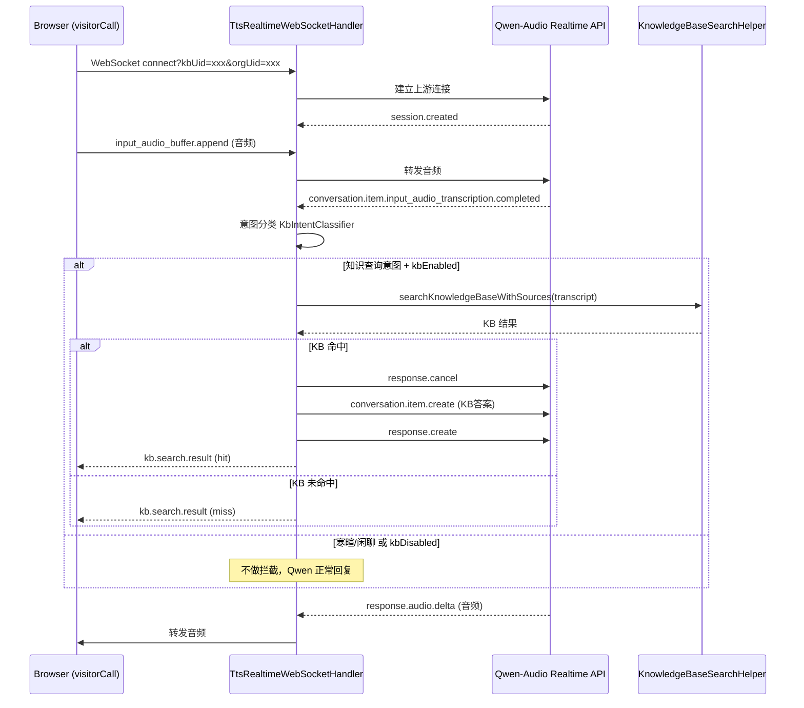

# visitorCall TtsRealtime 实时语音对话对接知识库规划

> 日期：2026-07-28
> 状态：✅ 首版已实现（后端 + 前端 + 单元测试），待端到端联调
> 关联 TODO：[TODO-2026.md](../../TODO-2026.md) 第 33 行
> 参考：[阶段 E 意图识别规划](./2026-07-25-kb-search-interim-prompt-plan.md#阶段-e增加意图识别按需触发-kb-检索)
> 说明：给 visitorCall 中 TtsRealtime 实时语音对话页面（Web 端麦克风 → Qwen-Audio Realtime）支持对接微语知识库，实现 KB 检索增强语音回答。
> 校准说明：本文已按当前仓内真实代码修正。尤其注意：Qwen 实际事件名为 `conversation.item.input_audio_transcription.completed`，且 `enterprise/call` 目前反向依赖 `enterprise/ai`，因此首版不能直接让 `enterprise/ai` 依赖 `enterprise/call` 复用实现。

---

## 0. 背景

### 0.1 当前状态

visitorCall 中的 `TtsRealtime` 页面对接的 `TtsRealtimeWebSocketHandler`（位于 `enterprise/ai`）是一个**纯中继处理器**：

```text
Browser (麦克风) ──WebSocket──▶ TtsRealtimeWebSocketHandler ──WebSocket──▶ Qwen-Audio Realtime API
                                    │                                          │
                                    ◀──────────── 纯双向转发 ───────────────────◀
```

- 后端不解析消息内容，不做任何拦截或增强
- 没有知识库检索能力
- 所有对话完全依赖 Qwen 大模型自身知识

### 0.2 目标状态

参考呼叫中心场景（`QwenRealtimeMediaWebSocketHandler`）已实现的知识库检索链路，给 visitorCall 的 `TtsRealtime` 增加同等的 KB 能力：

```text
Browser (麦克风) ──WebSocket──▶ TtsRealtimeWebSocketHandler ──WebSocket──▶ Qwen-Audio Realtime API
                                    │
                                    ├─ 拦截 conversation.item.input_audio_transcription.completed
                                    ├─ 意图分类（寒暄/闲聊→跳过KB）
                                    ├─ 异步 KB 检索（KnowledgeBaseSearchHelper）
                                    └─ KB 命中 → 取消当前响应 → 注入答案文本 → Qwen 播报
```

### 0.3 与呼叫中心场景的差异

| 维度 | 呼叫中心 (QwenRealtimeMediaWebSocketHandler) | visitorCall (TtsRealtimeWebSocketHandler) |
| --- | --- | --- |
| 音频通道 | FreeSWITCH ESL + mod_audio_stream | Qwen-Audio Realtime 直连 |
| 消息拦截 | 完整解析所有 Qwen 事件 | **当前无解析，全部透传** |
| KB 配置来源 | ExtensionSettingsKnowledgeEntity | **无分机概念，需新增配置来源** |
| 会话管理 | CallSession / ThreadEntity 完整生命周期 | **无会话持久化** |
| 等待提示 | ESL uuid_broadcast TTS | **需通过 Qwen 自身播报或前端展示** |
| kbUid / orgUid | 从分机号 → 组织解析 | **需通过 WebSocket 连接参数传入** |
| KbIntentClassifier | 已落地于 `enterprise/call` | **首版不能直接复用实现，需本模块独立落地或后续抽共享** |

---

## 1. 方案设计

### 1.1 整体架构

将 `TtsRealtimeWebSocketHandler` 从纯中继升级为**智能中继**：在保持双向转发的同时，对关键事件进行拦截处理。



### 1.2 核心改造点

#### A. 消息解析与拦截

当前 `TtsRealtimeWebSocketHandler` 的 `UpstreamListener.onText()` 只是简单地将 Qwen 消息转发给浏览器。改造后需要在转发之前**先解析 JSON，识别关键事件类型**。

需要拦截的事件：

| 事件类型 | 当前行为 | 改造后行为 |
| --- | --- | --- |
| `conversation.item.input_audio_transcription.completed` | 直接转发 | **拦截**：先做意图分类 + KB 检索，再决定是否注入 KB 答案 |
| `response.created` | 直接转发 | 转发 + 记录 `activeResponseId`，为后续 `response.cancel` 做准备 |
| `response.done` | 直接转发 | 转发 + 清空 `activeResponseId` |
| `response.audio_transcript.done` | 直接转发 | 转发 + 标注是否为 KB 来源 |
| `session.created` | 直接转发 | 转发 + 记录 session 就绪状态 |
| 其他事件 | 直接转发 | 保持直接转发 |

首版不建议改动浏览器到后端的音频上行协议。`handleTextMessage()` 仍以透传为主，KB 逻辑仅拦截上游 Qwen 返回事件，这样改动面最小。

#### B. KB 配置传入

由于 visitorCall 的 TtsRealtime 是无分机概念的 Web 页面，KB 配置需要通过以下途径传入：

##### 方案 B1（首版推荐）：WebSocket 连接参数

前端在建立 WebSocket 连接时，通过 query string 传入 kbUid 和 orgUid：

```text
wss://host/visitor/api/v1/tts/realtime?model=qwen-audio-3.0-realtime-plus&kbUid=xxx&orgUid=xxx
```

后端在 `afterConnectionEstablished` 中解析并保存这些参数。

##### 方案 B2（后续增强）：session.update 动态配置

参考 Qwen Realtime API 的 `session.update` 机制，浏览器在连接后发送自定义 `session.update` 消息来启用 KB。此方案更灵活但实现稍复杂，首版暂不做。

##### 方案 B3（后续增强）：管理后台配置

在管理后台增加一个"实时语音对话设置"页面，配置默认的 kbUid。首版暂不做。

#### C. 意图分类

呼叫中心已落地了 `KbIntentClassifier`，但**首版不应直接从 `enterprise/ai` 依赖 `enterprise/call`**，因为当前模块方向是 `enterprise/call -> enterprise/ai`，反向依赖会造成循环和职责倒置。

因此这里建议分两档：

1. **首版落地**：在 `enterprise/ai` 新增一份同逻辑的 `KbIntentClassifier`，只复制稳定规则，不顺带重构呼叫中心。
2. **后续收敛**：等 visitorCall 路径稳定后，再把该分类器抽到 `modules/ai` 之类的共享模块，统一被 `enterprise/ai` 和 `enterprise/call` 使用。

分类逻辑：

1. 短文本豁免（≤2 字符 → 跳过 KB）
2. 寒暄短语字典匹配（"你好""谢谢"等 → 跳过 KB）
3. 关键词匹配（疑问词 + 知识动词 + 业务名词 → 触发 KB）

#### D. KB 检索与结果注入

参考 `QwenRealtimeMediaWebSocketHandler.resolveKnowledgeBaseReply()` 与 `appendAssistantMessage()` 的实现：

```java
// 伪代码
SearchResultWithSources result = knowledgeBaseSearchHelper
    .searchKnowledgeBaseWithSources(transcript.trim(), robot);
if (results == null || results.isEmpty()) {
    // KB 未命中，不干预，让 Qwen 正常回复
    return;
}
// KB 命中 → 注入答案
String kbAnswer = results.get(0).getAnswer();
upstream.sendText(createResponseCancel(activeResponseId));
upstream.sendText(createConversationItem(kbAnswer));
upstream.sendText(createResponseRequest());
```

##### 注入方式

向 Qwen 上游发送 `response.cancel`（如果当前已有进行中的回答）+ `conversation.item.create`（注入 KB 答案作为 assistant 消息）+ `response.create`（让 Qwen 以该答案为上下文生成语音）。其中 `response.cancel` 的 payload 为 `{"type":"response.cancel","response_id":"<activeResponseId>"}`，与呼叫中心 `cancelActiveResponse()` 一致。

这里必须补一层响应状态跟踪：如果不记录 `response.created/response.done` 并在 KB 命中时取消当前回答，容易出现"Qwen 自己已经开始回答，同时又插入一条 KB 答案"的双回复或音频重叠问题。

##### 并发控制

与呼叫中心场景相同，需要 `pendingKbSearchId` + `CompletableFuture` 机制防止串话。

##### 依赖可用性

`enterprise/ai` 通过父 POM（`enterprise/pom.xml`）已以 `provided` scope 引入了 `bytedesk-module-ai`（含 `KnowledgeBaseSearchHelper`）和 `bytedesk-module-kbase`（含 `KbaseRestService`），无需额外加依赖。

#### E. 等待提示

当 KB 检索进行中时，前端需要显示"查询中"状态。

##### 方案 E1（首版推荐）：前端状态提示

在 `handleServerEvent` 中新增自定义事件类型，通知前端 KB 检索状态：

```typescript
case 'kb.search.started':
  setStatusText('🔍 查询知识库中...');
  break;
case 'kb.search.completed':
  setStatusText('✅ 已就绪');
  break;
```

比呼叫中心场景简单——不需要播放 TTS 等待音频，因为 Web 端用户可以直接看到文字状态。

##### 方案 E2（后续增强）：Qwen 语音播报等待提示

如果需要语音播报"查询中，请稍后"，可以像呼叫中心一样，发送 `conversation.item.create` + `response.create` 让 Qwen 先播报等待提示，再异步执行 KB 检索。首版不做，因为会引入额外的延迟和复杂度。

### 1.3 kbUid 合法性校验

需要在服务端验证传入的 `kbUid` 是否有效。这里建议直接基于现有 `KbaseRestService.findByUid()` / `KbaseRepository.findByUid()` 做校验，而不是为本任务新造一套查询链路：

1. 通过 `kbUid` 查询对应的知识库是否存在
2. 验证知识库未删除
3. 如果前端传了 `orgUid`，再校验 `kbase.orgUid` 一致；如果未传，则以后端查出的知识库归属为准
4. 如果 kbUid 无效 → 仅做中继，不触发 KB 检索（降级到纯 Qwen 模式）

首版不建议在这里额外引入“知识库启用状态”新约束，除非后续确认现有 `KbaseEntity` 上已有明确且稳定的启停语义。

### 1.4 首版收敛建议

为了避免这次 visitorCall 规划变成跨模块重构，首版建议明确收敛为以下边界：

1. **只改 visitorCall 页面与 `enterprise/ai` 的实时 TTS 中继链路**。
2. **不改呼叫中心现有 KB 检索主流程**，只复用思路，不强行共用类。
3. **不引入 DB migration**，kbUid 等配置先走前端连接参数。
4. **不做会话持久化**，避免把本次任务扩大到 Thread/Message 生命周期。
5. **不做“查询中，请稍后”的语音播报**，首版只做前端状态提示。
6. **不重写现有 `session.update` 协议**，继续保持浏览器端初始化逻辑。

---

## 2. 涉及改动（已实现）

### 2.1 后端改动

| 文件 | 改动 | 模块 |
| --- | --- | --- |
| `enterprise/ai/.../TtsRealtimeWebSocketHandler.java` | **核心改造**：新增 `RelaySessionState` 内部类封装会话状态、消息解析、响应状态跟踪、意图分类、异步 KB 检索、结果注入 | `enterprise/ai` |
| `enterprise/ai/.../TtsRealtimeKbIntentClassifier.java` | **新增**：关键词匹配器（与 `enterprise/call` 同逻辑，独立落地，为避免同名 bean 冲突使用不同类名） | `enterprise/ai` |
| `enterprise/ai/.../TtsRealtimeKbIntentClassifierTest.java` | **新增**：3 条用例（寒暄豁免、短文本豁免、知识型问句命中） | `enterprise/ai` |
| `enterprise/ai/.../TtsRealtimeWebSocketHandlerTest.java` | **新增**：4 条用例（kbUid 无效降级、orgUid 不匹配降级、寒暄不触发 KB、KB 命中全链路） | `enterprise/ai` |
| `modules/kbase/.../KbaseRestService` | 无需改动，直接复用 `findByUid()` 做 kbUid 合法性校验 | `modules/kbase` |
| `TtsRealtimeWebSocketConfig.java` | 无需改动 | `enterprise/ai` |

#### TtsRealtimeWebSocketHandler 实际改造要点

**新增内部类 `RelaySessionState`**（约 200 行），封装每个浏览器会话的全部 KB 相关状态：

```text
RelaySessionState 字段：
  - browserSession / requestedKbUid / requestedOrgUid / validatedKbase
  - upstream (上游 Qwen WebSocket 引用)
  - activeResponseId (跟踪 response.created → response.done)
  - handledInputItemIds (防止同一 itemId 重复触发)
  - pendingKbSearchId + pendingKbSearchFuture (并发控制)
  - closed (会话关闭标记)

RelaySessionState 关键方法：
  handleUpstreamEvent(type, json)
    → response.created → 记录 activeResponseId
    → response.done → 清空 activeResponseId
    → conversation.item.input_audio_transcription.completed → handleInputTranscriptCompleted()

  handleInputTranscriptCompleted(itemId, transcript)
    → 空文本/重复 itemId → 直接返回
    → validatedKbase 未启用 → 直接返回
    → kbIntentClassifier.isLikelyKnowledgeQuery() = false → 直接返回
    → 发送 kb.search.started 事件到浏览器
    → 异步调用 resolveKnowledgeBaseReply()
    → 回调 handleKbSearchResult()：
        - KB 未命中 → 发送 kb.search.completed (miss)
        - KB 命中 → cancelActiveResponse() + appendAssistantMessage() + createResponse()
                    → 发送 kb.search.completed (hit, answer)

  cancelActiveResponse()
    → 向 Qwen 发送 {"type":"response.cancel","response_id":"..."}

  appendAssistantMessage(previousItemId, message)
    → 向 Qwen 发送 conversation.item.create (role=assistant, content=KB答案)

  createResponse()
    → 向 Qwen 发送 response.create (modalities=["audio","text"])
```

**UpstreamListener 改动**：将原来的纯 `sendText(browserSession, payload)` 改为先调用 `relaySession.handleUpstreamEvent(type, json)` 再转发。JSON 解析失败时退化为原始透传。

**handleTextMessage() 不变**：浏览器 → 后端的音频上行仍然纯透传，KB 逻辑仅拦截上游 Qwen 返回事件。

**新增辅助方法**：

- `buildRelaySession()` — 解析 kbUid/orgUid 参数，校验知识库合法性，构造 RelaySessionState
- `validateKbase()` — 通过 `KbaseRestService.findByUid()` 校验：知识库存在、未删除、orgUid 匹配（可选）
- `resolveKnowledgeBaseReply()` — 调用 `KnowledgeBaseSearchHelper.searchKnowledgeBaseWithSources()`
- `getQueryParam()` 现在使用 `URLDecoder.decode()` 处理参数值

### 2.2 前端改动

| 文件 | 改动 |
| --- | --- |
| `frontend/apps/visitorCall/src/pages/TtsRealtime/index.tsx` | 新增 kbUid/orgUid 配置、KB 状态事件处理、KB 状态标签 |

#### 前端实际改造要点

1. **新增状态**：`kbUid`、`orgUid`（字符串）、`kbStatus`（`'idle' | 'searching' | 'hit' | 'miss' | 'error'`）
2. **连接参数**：WebSocket URL 使用 `URLSearchParams` 构造，仅当 kbUid/orgUid 非空时附加参数
3. **事件处理**：在 `handleServerEvent` switch 中新增两个 case：
   - `kb.search.started` → `setKbStatus('searching')` + 状态文字"🔍 查询知识库中..."
   - `kb.search.completed` → 根据 `event.result` 设置 hit/miss/error 状态和对应文字
4. **UI 标签**：在状态区 Tag 旁增加 KB 状态 Tag，仅在 `kbUid.trim()` 非空时展示，颜色随 kbStatus 变化（blue/idle、processing/searching、success/hit、default/miss、error/error）
5. **设置抽屉**：增加"知识库 kbUid"和"组织 orgUid"两个 Input 输入框，连接后禁用
6. **清理**：`ws.onopen` 和 `ws.onclose` 时重置 `kbStatus` 为 `'idle'`

### 2.3 后续共享组件提取（非首版）

如果后续确认 visitorCall 与呼叫中心两条链路都稳定，再做共享抽取：

| 文件 | 改动 |
| --- | --- |
| `modules/ai/.../KbIntentClassifier.java` | **新增/迁移**：把稳定规则上移到共享模块 |
| `enterprise/call/.../KbIntentClassifier.java` | 改为引用共享模块中的类 |
| `enterprise/ai/.../TtsRealtimeKbIntentClassifier.java` | 改为引用共享模块中的类（或删除，切换到共享实现） |

这一步不建议放进首版实施，否则本任务会同时触碰 visitorCall、enterprise/ai、enterprise/call 三条面。

---

## 3. 任务拆分（进度）

| 阶段 | 子任务 | 内容 | 估时 | 状态 |
| --- | --- | --- | --- | --- |
| **1** | 1-1 | 后端：TtsRealtimeWebSocketHandler 消息解析改造（解析 JSON、识别事件类型） | 0.5d | ✅ |
| **1** | 1-2 | 后端：补充 `activeResponseId` 跟踪与 `response.cancel` 逻辑 | 0.25d | ✅ |
| **1** | 1-3 | 后端：在 `enterprise/ai` 新增本地版 KbIntentClassifier | 0.25d | ✅ |
| **2** | 2-1 | 后端：kbUid 参数解析 + 合法性校验 | 0.25d | ✅ |
| **2** | 2-2 | 后端：集成 KnowledgeBaseSearchHelper + KB 结果注入 | 0.5d | ✅ |
| **2** | 2-3 | 后端：并发控制（pendingKbSearchId + CompletableFuture） | 0.25d | ✅ |
| **3** | 3-1 | 前端：kbUid 配置输入 + WebSocket URL 参数传递 | 0.25d | ✅ |
| **3** | 3-2 | 前端：KB 状态事件处理 + UI 提示 | 0.25d | ✅ |
| **4** | 4-1 | 测试：单元测试（TtsRealtimeKbIntentClassifier 3 条 + handler KB 分支 4 条） | 0.5d | ✅ |
| **4** | 4-2 | 测试：端到端验证（真实 Qwen 连接 + KB 检索） | 0.25d | ⏳ 待执行 |
| **合计** | | | **约 3.25d** | **已完成 3d / 待执行 0.25d** |

---

## 4. 测试用例

| 场景 | 输入 | 预期 | 自动化 |
| --- | --- | --- | --- |
| 知识查询 + KB 命中 | "退货政策是什么" + kbEnabled + kbUid 有效 | 触发 KB 检索 → 命中 → 播报 KB 答案 | ✅ `TtsRealtimeWebSocketHandlerTest#shouldSendKbStartedAndHit...` |
| 知识查询 + KB 未命中 | "火星上有没有水" + kbEnabled + kbUid 有效 | 触发 KB 检索 → 未命中 → Qwen 正常回答 | ⏳ 端到端 |
| 寒暄豁免 | "你好" + kbEnabled | 不触发 KB 检索 → Qwen 正常回答 | ✅ `TtsRealtimeWebSocketHandlerTest#shouldSkipKbWhenTranscriptIsGreeting` |
| 短文本豁免 | "嗯" + kbEnabled | 不触发 KB 检索 → Qwen 正常回答 | ✅ `TtsRealtimeKbIntentClassifierTest#shouldTreatShortUtteranceAsNonKnowledgeQuery` |
| KB 未启用 | 任何输入 + kbUid 为空 | 纯中继模式，不触发 KB 检索 | ⏳ 端到端 |
| kbUid 无效 | 任何输入 + kbUid=invalid | 降级到纯中继模式，不触发 KB 检索 | ✅ `TtsRealtimeWebSocketHandlerTest#shouldSkipKbWhenKbUidIsInvalid` |
| orgUid 不匹配 | kbUid 有效但 orgUid 与知识库归属不一致 | 降级到纯中继模式，不触发 KB 检索 | ✅ `TtsRealtimeWebSocketHandlerTest#shouldDisableKbWhenOrgUidDoesNotMatch` |
| 连续对话防串话 | 快速连续说两句话 | 第二次说话时取消第一次 KB 检索 | ⏳ 端到端 |
| KB 命中时已有模型回答进行中 | 先收到 `response.created`，后 KB 命中 | 发送 `response.cancel`，避免双回复 | ⏳ 端到端 |
| 前端状态显示 | KB 检索进行中 | 前端显示"查询知识库中..." | ⏳ 端到端 |
| 中英文混输 | "OK 谢谢" | 寒暄豁免，不触发 KB | ✅ `TtsRealtimeKbIntentClassifierTest#shouldTreatGreetingAsNonKnowledgeQuery` |
| 不带 kbUid 的连接 | WebSocket 连接不传 kbUid | 纯中继模式，不影响现有功能 | ⏳ 端到端 |

---

## 5. 验收口径

满足以下条件，即可视为首版完成：

1. **纯中继兼容**：不传 `kbUid` 参数时，行为与改造前完全一致（纯透传）
2. **KB 开关**：传入有效 `kbUid` 后，知识型问句能触发 KB 检索并播报 KB 答案
3. **意图分类**：寒暄/闲聊/短文本不触发 KB 检索，直接由 Qwen 回答
4. **降级处理**：kbUid 无效或 KB 未命中时，降级为 Qwen 直接回答
5. **响应正确性**：KB 命中时不会和 Qwen 正在生成的原始回答发生双回复或音频重叠
6. **并发安全**：快速连续说话不会导致 KB 结果串话
7. **前端反馈**：前端能展示 KB 检索状态（查询中 / 命中 / 未命中）
8. **不破坏现有功能**：不影响已有的 Qwen-Audio Realtime 语音对话和呼叫中心 KB 检索

---

## 6. 已知限制与后续增强

- **首版仅支持单一 kbUid**：通过 URL 参数传入，不支持对话过程中动态切换知识库
- **首版不做语音等待提示**：只在前端显示文字状态，不播报"查询中，请稍后"语音（后续可参考呼叫中心的 `broadcastTranscript` 方案）
- **首版不做会话持久化**：不创建 ThreadEntity / MessageEntity（后续可参考呼叫中心会话管理）
- **首版不引入管理后台配置**：kbUid 通过前端参数传入（后续可增加管理后台预设默认 kbUid）
- **LLM 意图兜底**：首版只做关键词匹配，LLM 二次判定作为后续增强（同呼叫中心阶段 E 的决策）
- **KbIntentClassifier 模块归属**：首版在 `enterprise/ai` 本地落地，后续再评估是否上移到共享模块
- **orgUid 语义**：首版中 `orgUid` 更适合作为可选校验条件，而不是必传参数

---

## 7. 待确认事项（实施后结论）

以下为规划阶段提出的默认决策，实施后均已按原决策落实：

- [x] **kbUid 传入方式**：使用 WebSocket URL query string 传入（`?kbUid=xxx&orgUid=xxx`）。前端使用 `URLSearchParams` 构造参数，仅非空时附加。
- [x] **kbUid 来源**：前端设置抽屉手工填写，不内置默认值。
- [x] **orgUid**：作为可选 query 参数，仅用于服务端校验（`kbase.orgUid` 一致性检查），不作为必填。
- [x] **KbIntentClassifier 落点**：在 `enterprise/ai` 本地新增 `com.bytedesk.ai.tts.aliyun.realtime.TtsRealtimeKbIntentClassifier`，与 `enterprise/call` 的 `com.bytedesk.call.visitor.KbIntentClassifier` 逻辑相同但类名不同（避免 Spring `@Component` 同名 bean 冲突）。
- [x] **等待提示方式**：前端文字状态提示（`kb.search.started` → "🔍 查询知识库中..."，`kb.search.completed` → 命中/未命中/失败三种结果），不播报等待语音。
- [x] **会话持久化**：不做 Thread/Message 落库。
- [x] **后续重构边界**：KbIntentClassifier 后续可单独抽到 `modules/ai` 共享模块，届时 `enterprise/call` 和 `enterprise/ai` 统一引用。
